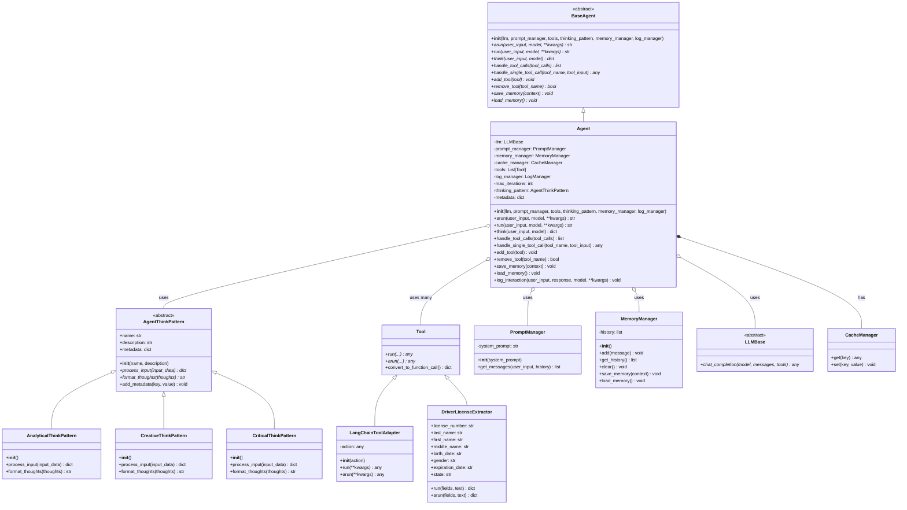

# Agent Framework Class Diagram

Below is a detailed class diagram showing the relationships between the main components in the agent framework.

## Key Relationships Explained

1. **Inheritance Relationships**:
   - `Agent` inherits from `BaseAgent` - implements the abstract interface
   - `AnalyticalThinkPattern`, `CreativeThinkPattern`, and `CriticalThinkPattern` inherit from `AgentThinkPattern`
   - Both `LangChainToolAdapter` and `DriverLicenseExtractor` inherit from `Tool`

2. **Composition Relationships**:
   - `Agent` has a `CacheManager` (composition - lifecycle managed by Agent)
   - `Agent` uses various objects (aggregation - independent lifecycles):
     - `LLMBase` - for language model interaction
     - `PromptManager` - for message formatting
     - `MemoryManager` - for conversation history
     - `AgentThinkPattern` - for thought processing
     - `Tool` - for extending capabilities

## Usage Flow

1. Client code creates dependencies (LLM, PromptManager, Tools)
2. Client creates an Agent with these dependencies
3. Client calls agent.arun() or agent.run() with user input
4. Agent processes input, potentially using tools, thinking patterns, and memory
5. Agent returns response to client 